# General Assembly

## Project-4: FastLaneFleet

### Overview

FastLaneFleet serves as a platform for users to explore a carefully selected selection of their preferred cars. Users can log in or register to showcase their personally crafted vehicles. The application boasts functionalities focusing on updating, deleting, and creating individual car profiles.

### Technology Used and Website Link

- JavaScript
- Python
- React

[FastLaneFleet](https://fast-lane-fleet-ca656b590bcf.herokuapp.com/)  

### Brief

Within a specified one-week timeframe, my aim was to conceive and craft a fully functional full-stack website, accompanied by a bespoke backend solution. This project was undertaken independently, with the objective of demonstrating proficiency in both front-end and back-end development disciplines.

### Project Requirements

- Full-Stack Development: Develop a complete application with both backend and front-end components.
- Backend with Django API: Create a Python Django API using Django REST Framework to serve data from a Postgres database.
- Front-end with React: Build a separate front-end using React to consume the API.
- CRUD Functionality: Implement CRUD functionality for at least a couple of models, demonstrating multiple relationships within the application.
- User Stories and Wireframes: Define and incorporate thoughtful user stories and wireframes to guide the development process, distinguishing core MVP features from secondary ones.
- Visual Design: Design visually impressive interfaces to elevate the portfolio and leave a lasting impression on clients and potential employers.
- Deployment: Deploy the application online to make it publicly accessible.

### Planning

On the first day, I brainstormed numerous ideas and settled on my passion for cars as the theme for my project. Following this, I carefully sketched out wireframes for each webpage. Subsequently, I chose the name "FastLaneFleet" for the project. Throughout this phase, I prioritized thorough planning, recognizing its importance in achieving project success.

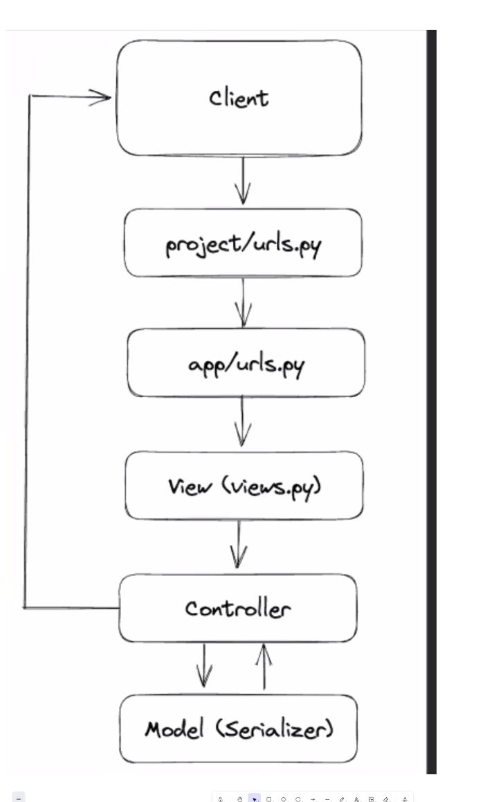

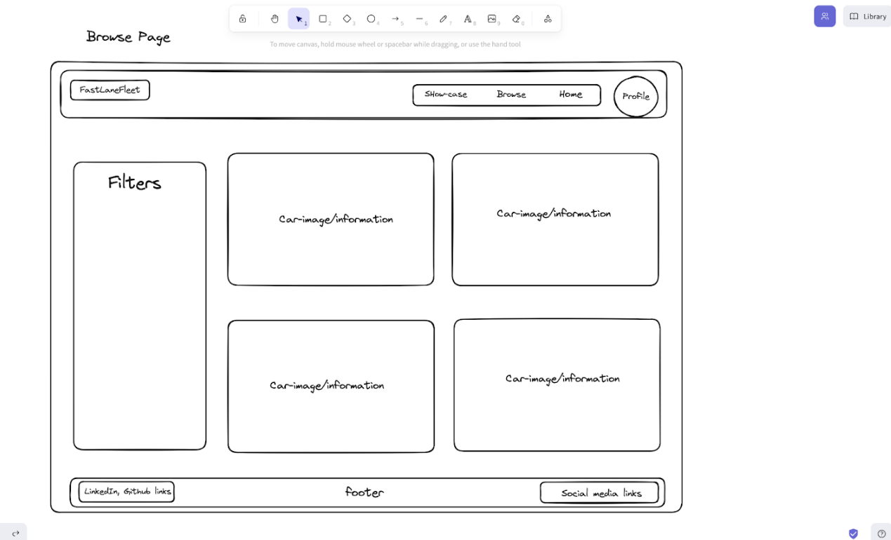

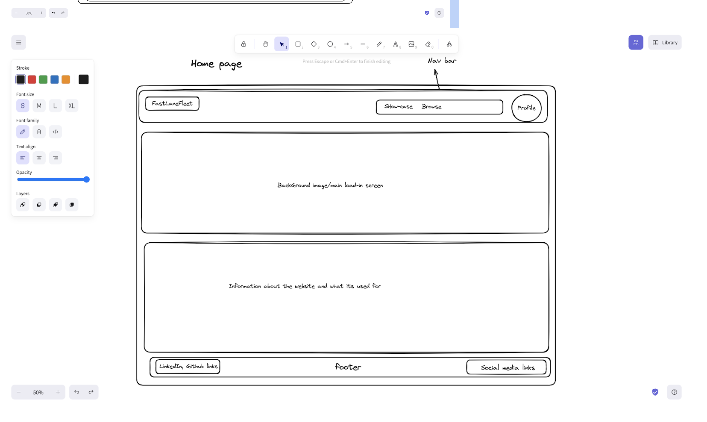

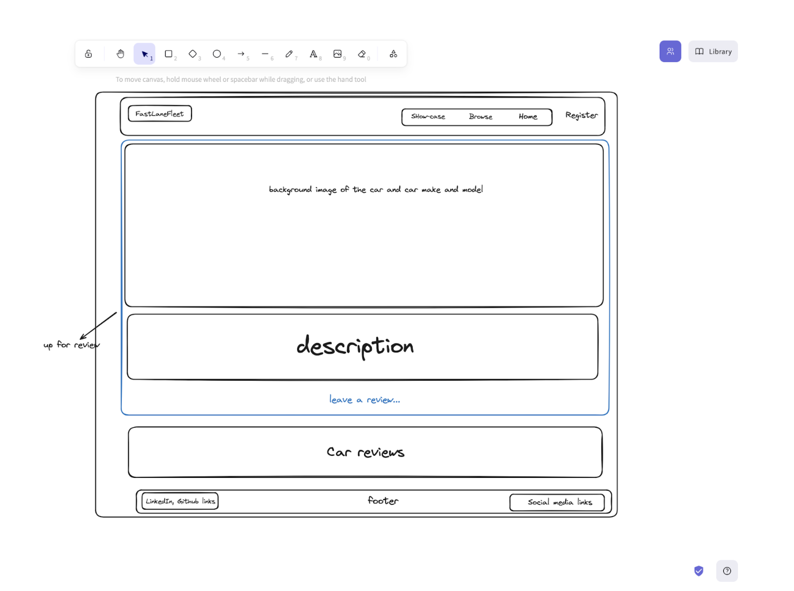

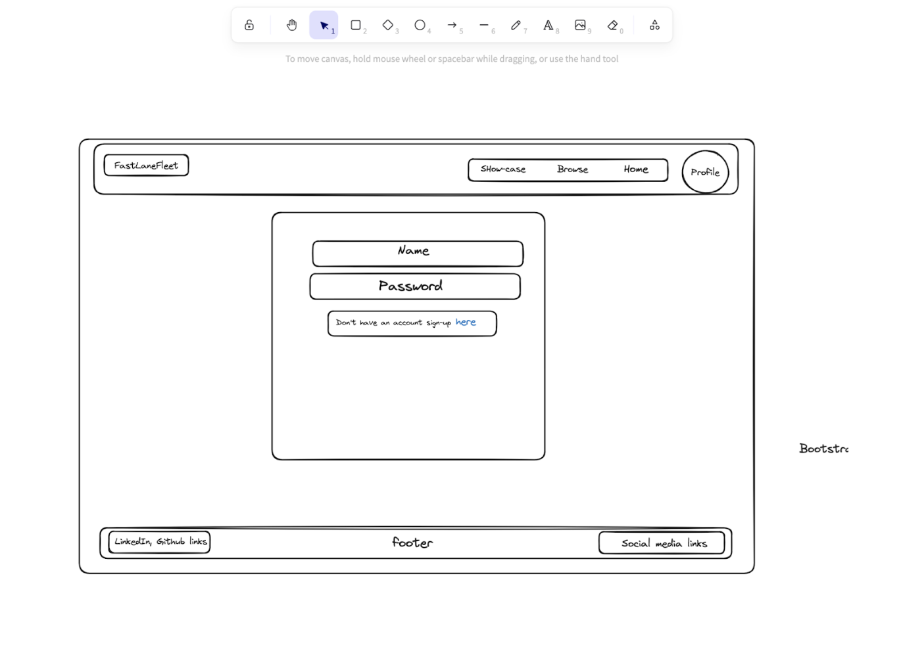

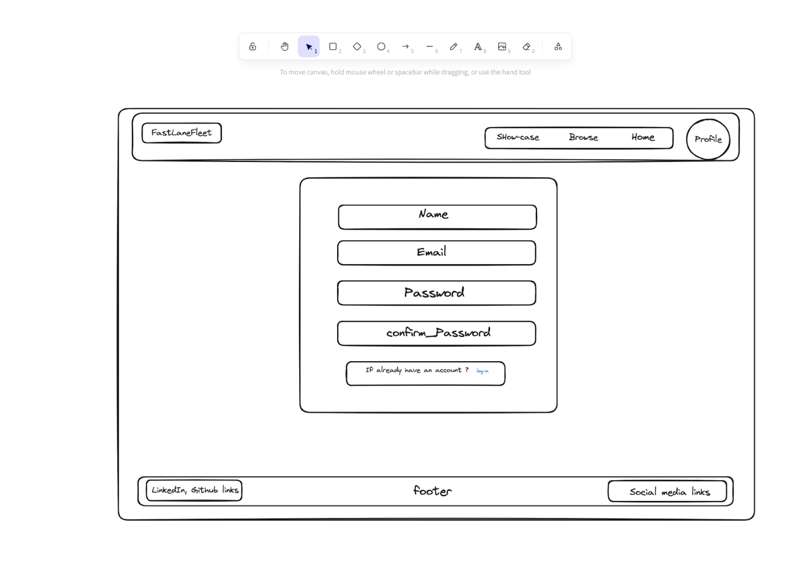

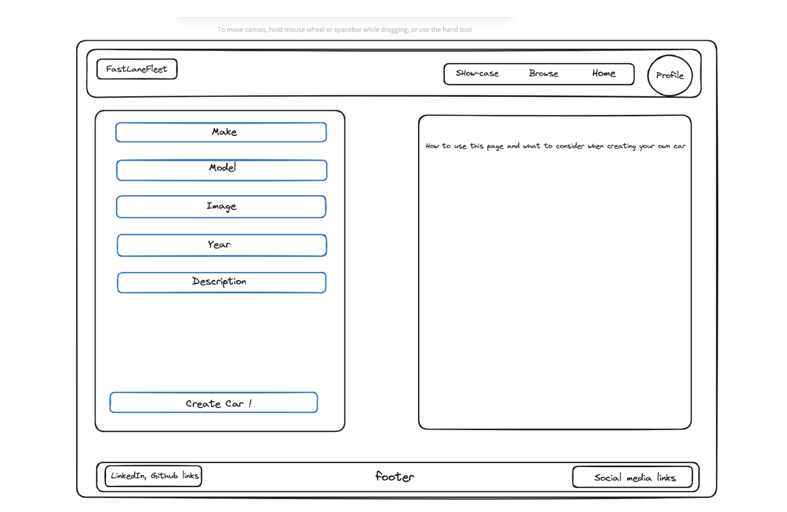

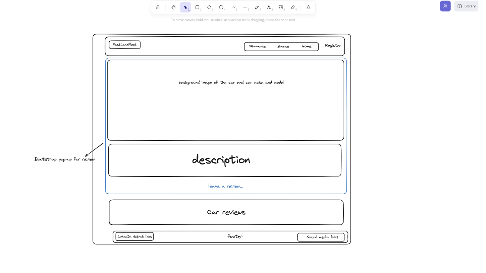

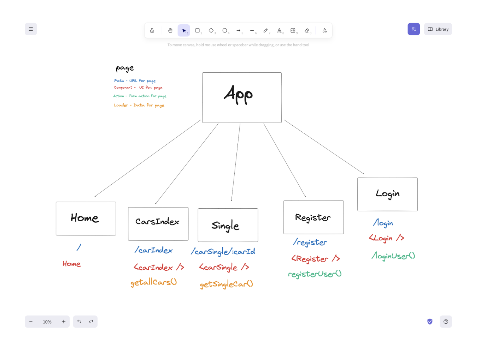

### Approach Taken

#### Day 1:
Dedicated to meticulous planning and creating wireframes for each webpage.

#### Day 2:
Organized all the folders and files for the backend and initiated work on the backend.

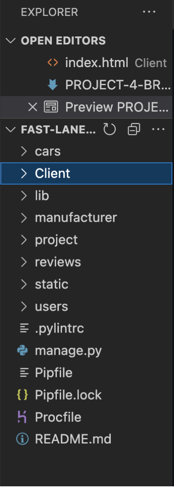

#### Day 3:
Encountered a critical issue concerning the user relationship, leading to a restart of the backend.

#### Day 4:
Commenced work on the frontend, established the folder and file structure, and implemented paths for each page.

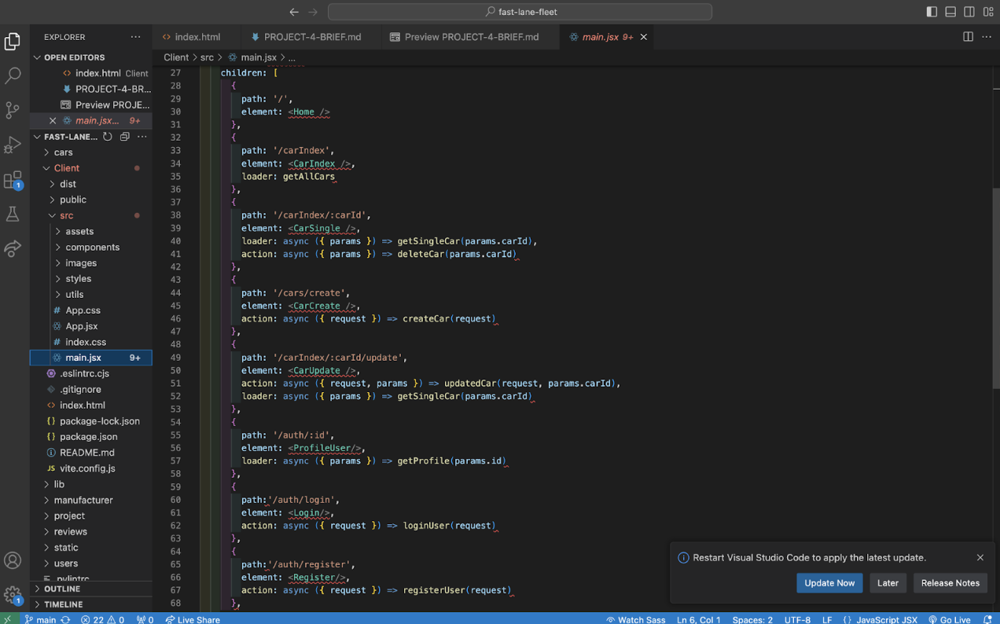

#### Day 5:
Populated all pages with relevant information and initiated the design phase of the project.

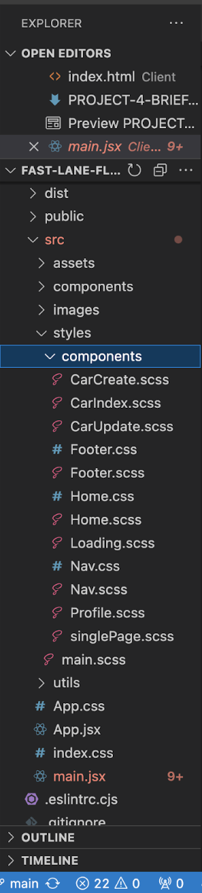

#### Day 6:
Finalized all components and thoroughly tested for functionality. Some desired styling elements remained unimplemented.

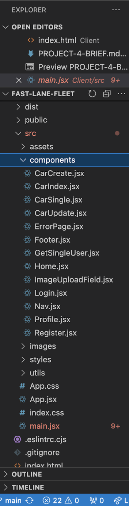

#### Day 7:
Refined the project with minor enhancements such as error handling and incorporating subtle animations.

### Project Wins and Key Learnings

- Successfully created a fully functional website.
- Demonstrated persistence during moments of frustration.
- Key takeaway includes effectively utilizing internet resources.

### Challenges

Encountered numerous 404 and 401 errors, along with persistent bad requests. Despite facing these challenges, I remained composed and diligently reviewed the issues repeatedly.

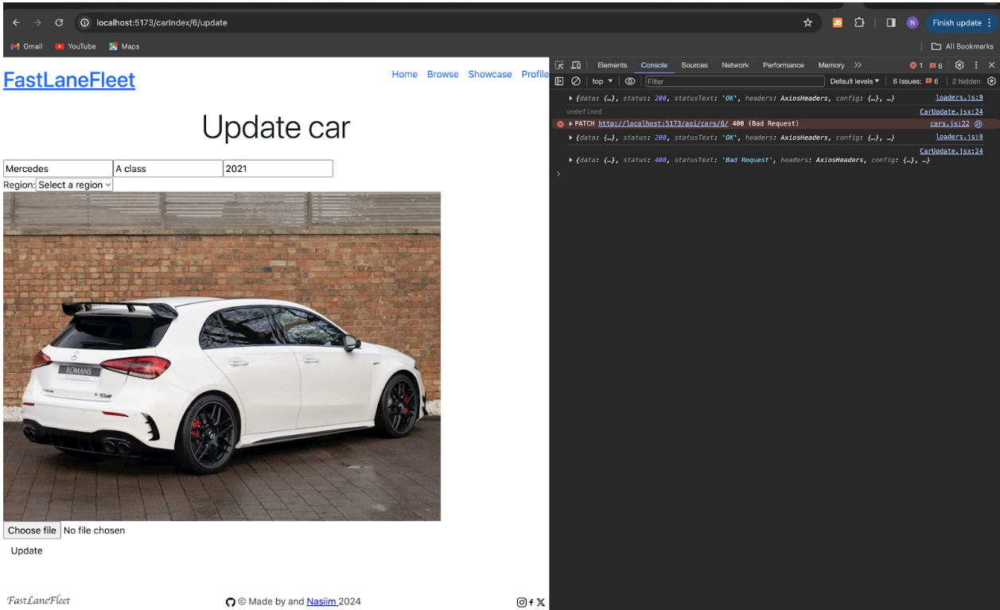

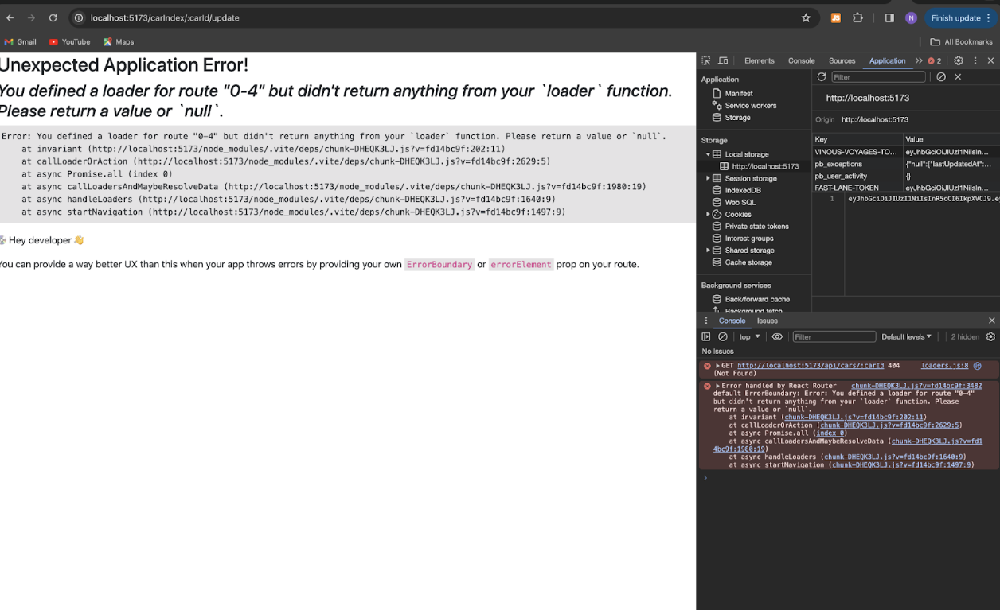

### Future Improvements

- Integrate a comments section for user feedback.
- Resolve the challenge of positioning the background image behind all text elements and the navigation bar.
- Refine the website's overall aesthetic to elevate its professionalism.
